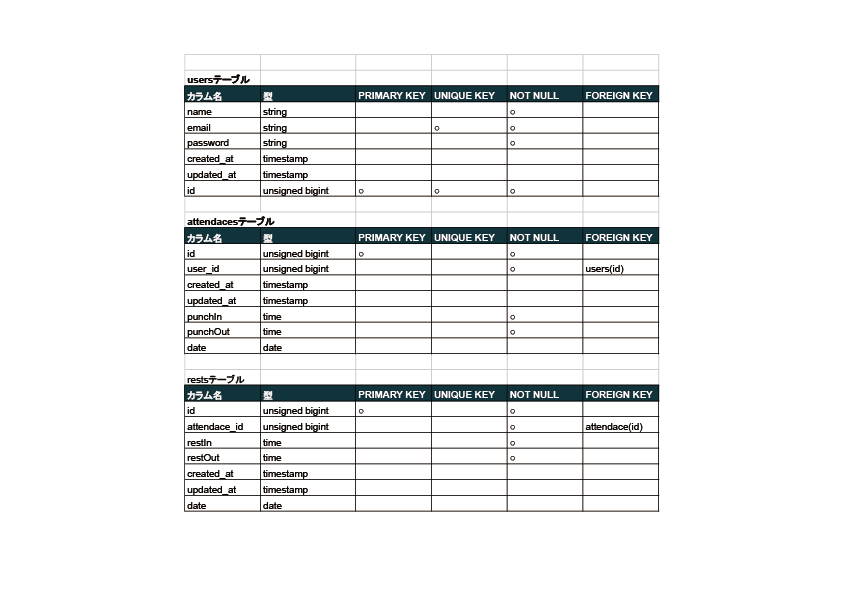
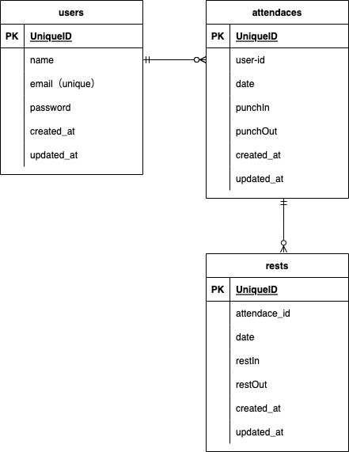

# 勤怠アプリ　　Atte
　
# 作成した目的
アドバンスタームの課題。
タイムカードを手書きしている店舗への勤怠管理システムの導入のため。と考えた。
　
# アプリケーションURL
https://atte-une.herokuapp.com/
　
# 機能一覧
・ログイン/会員登録機能
・出勤/退勤/休憩打刻機能
・日付別勤怠確認機能
　
# 使用技術
laravel8.83.23
　 
# テーブル設計書
;

# ER図
